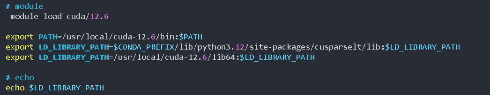

# 用 cmake 配置并且使用 ninja生成构建文件
```
cmake -S . -B build -G Ninja \
  -DCMAKE_BUILD_TYPE=Debug \
  -DCMAKE_EXPORT_COMPILE_COMMANDS=ON \
  -DCMAKE_CXX_COMPILER=/usr/bin/clang++ \
  -DCMAKE_CUDA_COMPILER=/usr/local/cuda-12.6/bin/nvcc \
  -DCMAKE_CUDA_HOST_COMPILER=/usr/bin/g++ \
  -DCMAKE_CUDA_ARCHITECTURES=86 \
  -DCUDA_TOOLKIT_ROOT_DIR=/usr/local/cuda-12.6 \
  -DCMAKE_CXX_FLAGS="-I/usr/local/cuda-12.6/include" \
  -DCMAKE_CUDA_FLAGS="-I/usr/local/cuda-12.6/include" \
  -DCMAKE_EXE_LINKER_FLAGS="-L/usr/local/cuda-12.6/lib64" \
  -DCMAKE_SHARED_LINKER_FLAGS="-L/usr/local/cuda-12.6/lib64 -lcudart"
```

这条命令是在一行里调用 CMake 来配置（configure）你的项目构建，具体含义和作用如下：(最好不要让cmake工具自动去处理一些事情，工具会抽风)
- -S .
	指定「源代码」目录为当前目录（.），也就是告诉 CMake 去哪个地方找你的 CMakeLists.txt。
- -B build
	指定「构建」目录为 build，实现「out-of-source build」（源码目录外构建）。所有生成的中间文件、目标文件、以及最终的 Makefile／ Ninja 文件都放在 build/ 子目录下，不会污染源码目录。
- -DCMAKE_EXPORT_COMPILE_COMMANDS=ON
	将 CMAKE_EXPORT_COMPILE_COMMANDS 这个 cache 变量设为 ON，使 CMake 在生成构建系统时额外输出一个 compile_commands.json 文件。
- -GNinja
	指定使用 Ninja 作为底层构建系统（Generator），而不是默认的 Makefile。
- -DCMAKE_CUDA_COMPILER=/usr/bin/clang++
	手动设置 CMake 用来处理 CUDA 代码（.cu 文件）的「CUDA 编译器」。
- -DCMAKE_CUDA_HOST_COMPILER=/usr/bin/g++  让 g++ 做 host 编译
- 指定 -DCMAKE_CUDA_ARCHITECTURES=86（不写 “native”），即可跳过 GPU 探测直接生成针对 8.6 架构的设备代码。
- -DCMAKE_CXX_FLAGS 会把 -I/usr/local/cuda-12.6/include 加到所有用 Clang++ 编译的 .cpp 文件里
- -DCMAKE_CUDA_FLAGS 会把同样的 include 路径传给 nvcc
- -DCMAKE_EXE_LINKER_FLAGS（或你也可以用 -DCMAKE_SHARED_LINKER_FLAGS）把 CUDA 的库目录加到链接时搜索路径。DCMAKE_CXX_FLAGS,DCMAKE_CUDA_FLAGS,DCMAKE_EXE_LINKER_FLAGS这三个可以让 Clang++ 找到 cuda_runtime.h，链接器也能找到 libcudart.so，编译、链接都会通过。

> 这行命令会在 build/ 目录下，用 Ninja 生成一个完整的、带有 compile_commands.json 的构建系统配置，并且告诉 CMake 用 Clang 而非默认的 NVCC 去处理 CUDA 源文件。之后你只需切换到 build/ 目录，运行 ninja 就可以开始编译了。


# 执行构建文件
进入 build 目录，调用 ninja （或者用 cmake 的通用接口）
```
# 方式一：直接用 ninja
ninja -C build
# 方式二：用 cmake --build（等同于上面）
cmake --build build
```
如果只是想构建某个特定目标（假设 CmakeLists.txt 里写了 add_executabale(my_app) ）
```
cmake --build build --target my_app
```
# 关于 bash 中的环境变量设置



如果服务器重启了的话， module环境丢失，需要在 bash 用户环境中加上

